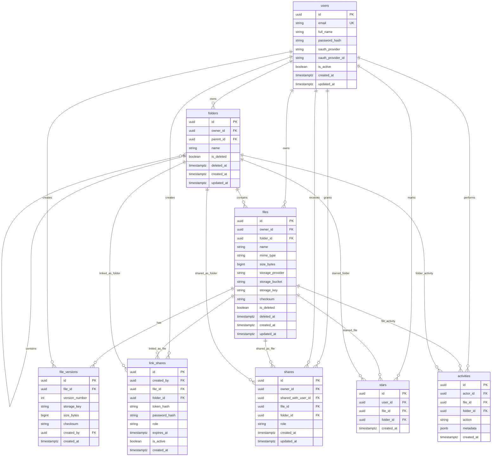

# Entity Relationship Diagram

## Relationship Notes

- A folder can contain child folders and files through `parent_id` and `folder_id`.
- A share points to either a file or a folder.
- A public link points to either a file or a folder.
- A star points to either a file or a folder.
- Soft delete is represented by `is_deleted` and `deleted_at`.
- `file_versions` is included in the schema because the PDF lists it as a core table, but version UI can remain optional until Phase 2.

